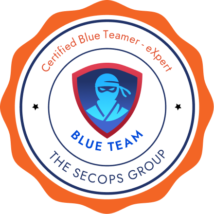

   

  

  

    
    
  

  

    
  

  
  
  

  

    
    
    
  

## 🥷🏻 Badges
<table align="center">
<tr>
<td></td>
<td></td>
<td></td>
<td></td>
<td></td>
</tr>

<tr>
<td></td>
<td></td>
<td></td>
<td></td>
<td></td>
</tr>

<tr>
<td></td>
<td></td>
<td></td>
<td></td>
<td></td>
</tr>

<tr>
<td></td>
<td></td>
<td></td>
<td>
<a>–</a>
</td>
<td>
<a>–</a>
</td>
</tr>
<tr>
<td colspan="5" align="left">

> [!TIP]
> If you need access to the private repository with the very large number of up-to-date and retired writeups / walkthrough of **HTB** (**HackTheBox**) machines, pro labs and academy modules, please contact me in [Discord](https://discordapp.com/users/576089608736210959).

</td>
</tr>
</table>

 

## 👀 Profile Views Counter

  

 

## ⭐ GitHub Stats

  
  

 

  

